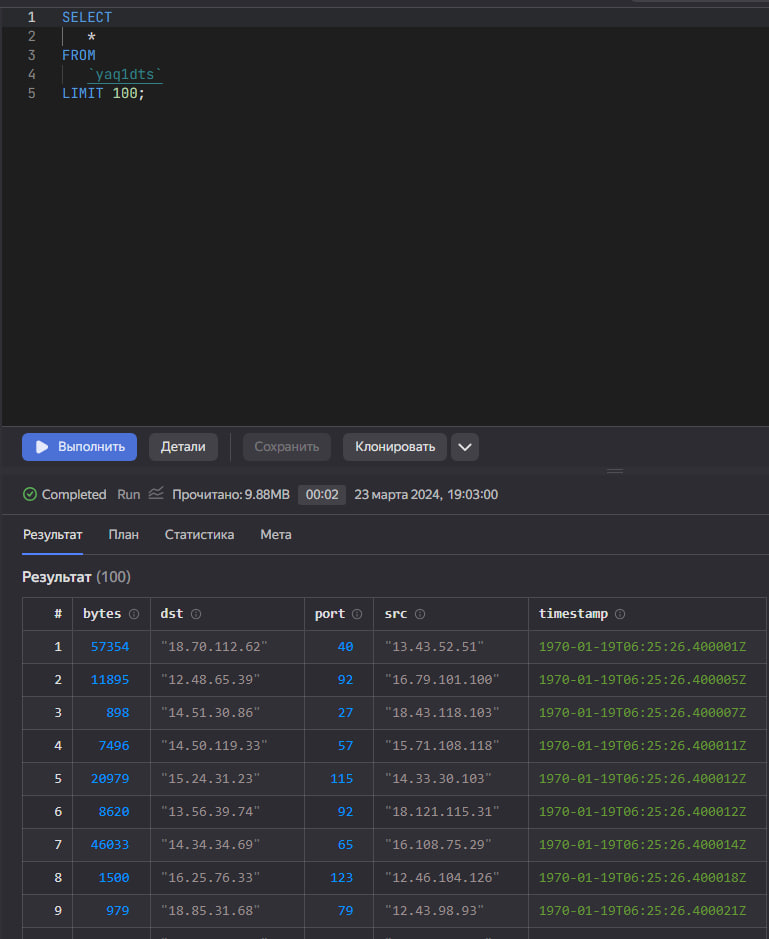

# 1. Использование технологии Yandex Query для анализа данных сетевой активности

## Цель работы

1.  Изучить возможности технологии Yandex Query для анализа
    структурированных наборов данных.

2.  Получить навыки построения аналитического пайплайна для анализа
    данных с помощью сервисов Yandex Cloud.

3.  Закрепить практические навыки использования SQL для анализа данных
    сетевой активности в сегментированной корпоративной сеть.

## Исходные данные

1.  ОС Windows 10.

2.  RStudio.

3.  Yandex Cloud.

4.  Yandex Query.

## Задание

Используя сервис Yandex Query настроить доступ к данным, хранящимся в
сервисе хранения данных Yandex Object Storage. При помощи
соответствующих SQL запросов ответить на вопросы.

## Ход работы

Для выполнения предложенного задания нам необходимо последовательно
проделать следующие шаги:

-   Проверить доступность данных в Yandex Object Storage Проверьте
    доступность данных (файл yaqry_dataset.pqt) в бакете arrow-datasets
    S3 хранилища Yandex Object Storage. Проверить можно просто перейдя
    по правильно сконструированному URL в браузере.

`https://storage.yandexcloud.net/arrow-datasets/yaqry_dataset.pqt`

-   Подключить бакет как источник данных для Yandex Query

Yandex Query – это облачное решение для анализа данных, в котором задачи
организации хранения, обеспечения доступа и выполнения первичного
анализа данных полностью берет на себя сервис-провайдер, то есть Yandex
Cloud.

Перед проведением анализа нам надо связать Yandex Query с хранилищем
наших данных. В нашем случае это S3 Object Storage от Yandex Cloud.

1. Создать соединение для бакета в S3 хранилище.
2. Заполняем поля с учетом допустимых символов, выбираем тип аутентификации (все же помнят что это такое!) – публичный. Вводим имя бакета в соответствующее поле и сохраняем.
3. Теперь, после создания соединения, укажем какой объект использовать в качестве источника данных. Для этого нужно сделать привязку данных.
4. Настройка привязки данных.

Если настройки сделаны правильно, то можно попробовать сделать
аналитический запрос и посмотреть результат

## Анализ

Решите следующие задания:

-   Известно, что IP адреса внутренней сети начинаются с октетов,
    принадлежащих интервалу 12-14. Определите количество хостов
    внутренней сети, представленных в датасете.

<!-- -->

    SELECT COUNT(DISTINCT src) host_cnt
    FROM `yaq1dts`
    WHERE src REGEXP '(^1[2-4].)';

-   Определите суммарный объем исходящего трафика

<!-- -->

    SELECT SUM(bytes) bytes, 
           SUM(bytes) / (1024 * 1024 * 1024) Gb
    FROM `yaq1dts`
    WHERE src REGEXP '(^1[2-4].)';

-   Определите суммарный объем входящего трафика

<!-- -->

    SELECT SUM(bytes) bytes, 
            SUM(bytes) / (1024 * 1024 * 1024) Gb
    FROM `yaq1dts`
    WHERE dst REGEXP '(^1[2-4].)';

## Вывод

В ходе достижения поставленных целей были развиты практические навыки по
использованию технологии Yandex Query для анализа структурированных
наборов данных. Было изучено, как проводить аналитические запросы на
данных, работать с большими объемами данных. Также были получены навыки
построения аналитического пайплайна для анализа данных с помощью
сервисов Yandex Cloud. Было изучено, как использовать сервисы Yandex
Cloud для хранения, обработки и анализа данных. Кроме того, были
закреплены практические навыки использования SQL для анализа данных
сетевой активности в сегментированной корпоративной сети. Было изучено,
как использовать SQL для проведения различных операций над данными,
таких как фильтрация, агрегация и объединение.
